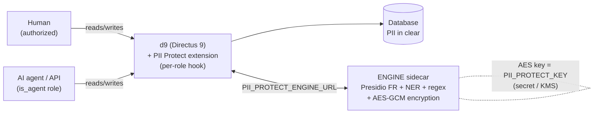

# Architecture — d9 PII Protect

Two bricks, decoupled by an environment variable. **One engine per environment** (dev / staging /
prod): no central proxy, PII never leaves its environment (confinement principle).

```
                        ENVIRONMENT (dev / staging / prod)
  ┌──────────────────────────────────────────────────────────────────────────┐
  │                                                                            │
  │   AI agent / API ─────────┐                                                │
  │   (role "is_agent")        │  reads/writes items & files                   │
  │                            ▼                                                │
  │                    ┌───────────────┐   PII_PROTECT_ENGINE_URL   ┌────────┐ │
  │   Human ──────────▶│      d9       │ ─────────────────────────▶ │ ENGINE │ │
  │   (sees clear)     │  (Directus 9) │ ◀───────────────────────── │(sidecar)│ │
  │                    │  + extension  │     text <-> markers         └────────┘ │
  │                    │  PII Protect  │                             Presidio FR │
  │                    └───────┬───────┘                             + FR NER    │
  │                            │                                     + regex     │
  │                            ▼                                     + AES-GCM    │
  │                        Database                                  (key = env)  │
  │                   (PII IN CLEAR, protected by RBAC)                           │
  └──────────────────────────────────────────────────────────────────────────┘
```


```mermaid
flowchart LR
    agent["AI agent / API<br/>(is_agent role)"]
    human["Human<br/>(authorized)"]
    d9["d9 (Directus 9)<br/>+ PII Protect extension<br/>(per-role hook)"]
    db[("Database<br/>PII in clear")]
    engine["ENGINE sidecar<br/>Presidio FR + NER + regex<br/>+ AES-GCM encryption"]

    human -->|reads/writes| d9
    agent -->|reads/writes| d9
    d9 <-->|PII_PROTECT_ENGINE_URL| engine
    d9 --> db
    engine -. "AES key = PII_PROTECT_KEY<br/>(secret / KMS)" .- engine
```

## Who does what

| Brick | Role | Tech | Repo contents |
|---|---|---|---|
| **Engine** (`engine/`) | Detects PII in a text and encrypts/decrypts it. | Python, [Presidio](https://microsoft.github.io/presidio/) (orchestration) + FR NER [Anonym-IA](https://huggingface.co/Anonym-IA/V2-camembert-ner-pii-french) + regex/checksum recognizers + AES-256-GCM | `Dockerfile`, `app.py`, `analyzer.py`, `recognizers.py`, `ner.py`, `crypto.py`, `image_redact.py`, `MODELS.md` |
| **Extension** (`extension/`) | Integrates the engine into d9 as one hook. Anonymizes on read for "agent" roles, rehydrates on write, and for authorized humans. | TypeScript (Directus hook) | `src/index.ts`, `dist/index.js` |
| **Deploy** (`deploy/`) | Reference stack wiring the two together. | docker-compose | `docker-compose.yml`, `.env.example` |

## The flow, step by step

1. An **agent** (role with `is_agent = true`) reads an item. The d9 hook calls `POST /anonymize`
   on the engine for each relevant free-text field.
2. The engine **detects** PII (FR NER + regex + Presidio context scoring) and replaces each value
   with an encrypted marker `[[PII:TYPE:base64(nonce+ciphertext)]]`.
   → the agent **never** sees the clear value; a random nonce per value prevents any equality leak
   or brute-force without the key.
3. The agent **writes** (create/update) a text containing markers. The hook calls `POST /rehydrate`:
   the engine **decrypts** and restores the clear value before storage.
4. An **authorized human** reads normally: no anonymization (d9 RBAC decides who is authorized).
5. **Fail-closed**: if the engine is unreachable, the agent gets `[protected — unavailable]` rather
   than the clear value.

## Design decisions

- **Secure-by-default**: without configuration, all `text`-type fields are protected for agent roles.
  RBAC already covers structured fields; we cover the **free-text fields**, where unexpected PII can
  slip in. You can then restrict by field (`PII_PROTECT_FIELDS`) and by PII type
  (`PII_PROTECT_ENTITIES` / `PII_PROTECT_SKIP`).
- **Reversible encryption, not masking**: we re-identify for authorized humans. Key custody
  (`PII_PROTECT_KEY`) **is** the security boundary.
- **Embedded Presidio**: reuse its recognizer registry and context scoring
  (which disambiguates e.g. SIREN vs NIR), and keep **our own** encryption (Presidio's unsalted
  `hash` is insufficient).
- **One engine per environment**: confinement. No central proxy through which every environment's
  data would transit.
- **No custom logs**: activity is already tracked by d9's native **audit**.

## Customizable points (flagged in the code)

- Add a **regex** / recognizer → `engine/recognizers.py` ("ADD A REGEX RECOGNIZER" block).
- Change the **NER model** (other language, other model) → env `PII_NER_MODEL`, see `engine/MODELS.md`.
- Choose **which types** are encrypted → `PII_PROTECT_ENTITIES` / `PII_PROTECT_SKIP`.
- Choose **which fields** are processed → `PII_PROTECT_FIELDS`.
